## 一、jupyter

### 1.1 环境部署

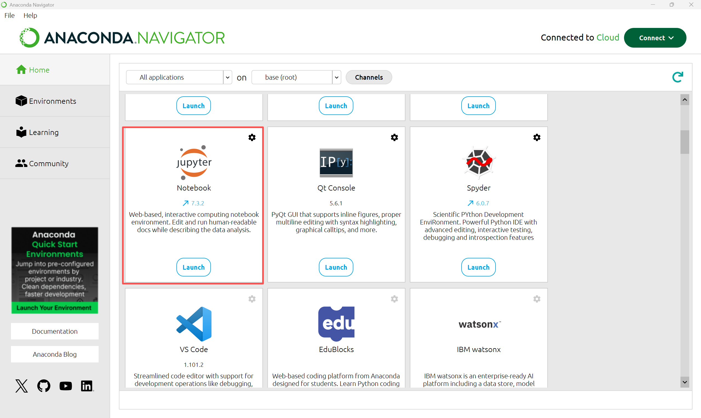

Anaconda里面直接launch就可以


### 1.2 修改Anaconda里面的jupyter的默认路径

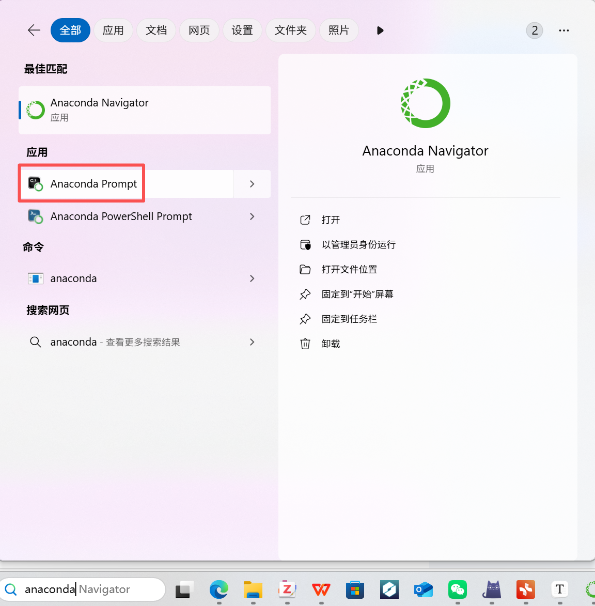


输入以下命令

```bash
jupyter notebook --generate-config
```


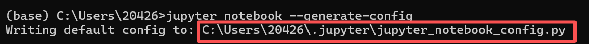


之后找到这个路径的配置文件，在里面全局搜索`c.ServerApp.root_dir`

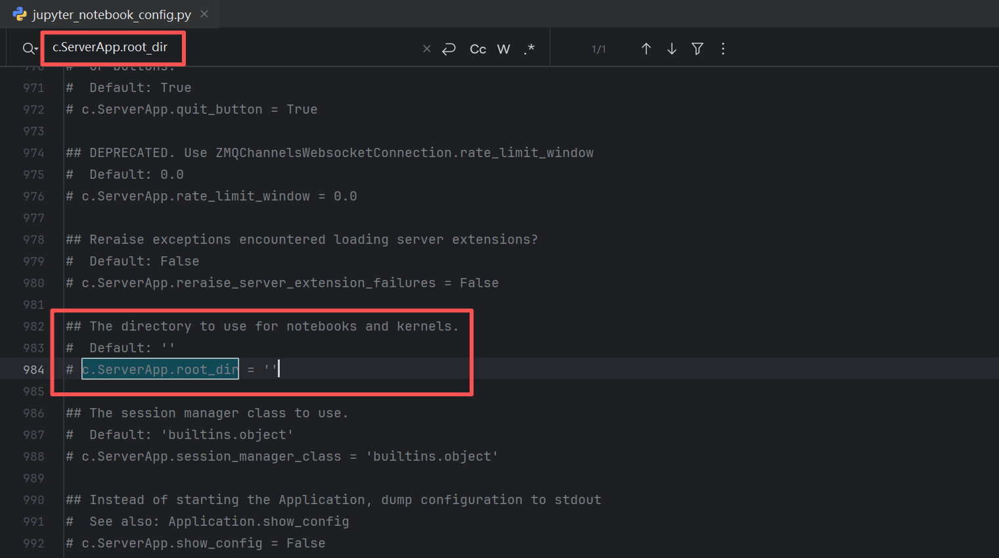

将这个路径修改为你想要的目录

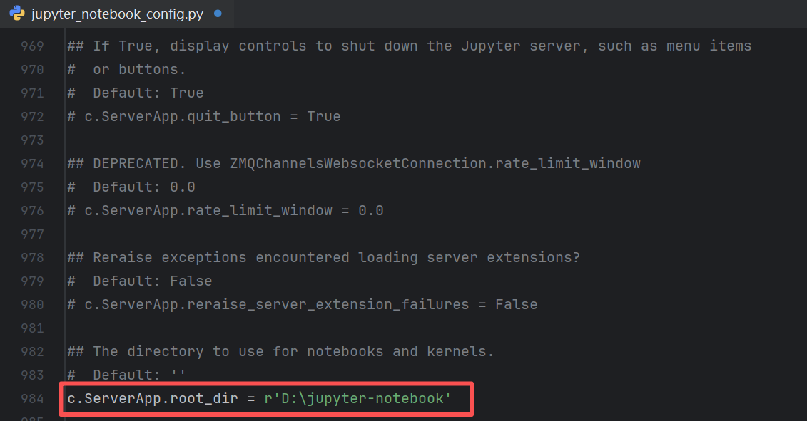

注意要把前面的#号去掉，路径前面要加r进行转义，之后记得保存文件之后，再次打开，就会发现目录进行修改


### 1.3 环境使用

可以通过http://localhost:8888/tree进行访问

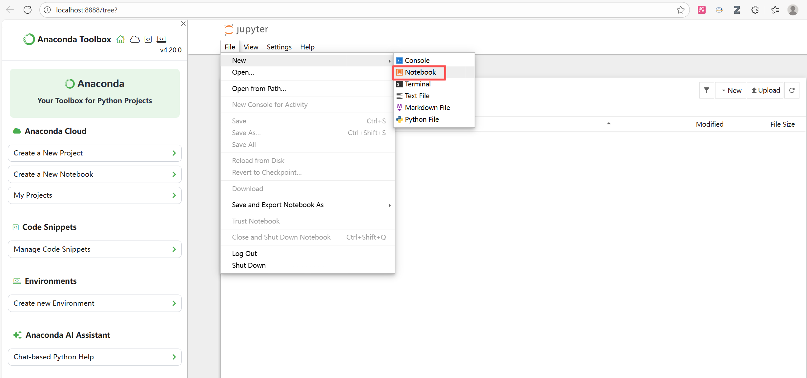

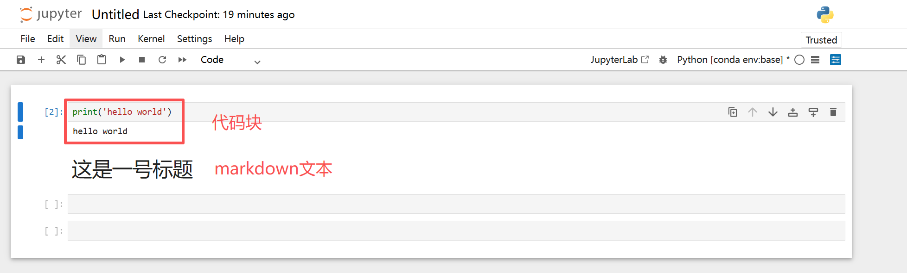


简单的快捷键

`ESC+A`：在当前单元格上方插入新单元格

`ESC+B`：在当前单元格下方插入新单元格

`ESC+M`：在当前单元格转化为Markdown格式

`Ctrl+Enter`：运行当前单元格

`Shift+Enter`：运行当前单元格并选择下一个单元格


如果在jupyter里面想要运行命令，可以在命令之前加上一个!

比如：如果想查看python版本可以使用

```bash
! python --version
```

如果想安装库

```bash
! pip install numpy
```


### 1.4 为不同的虚拟环境配置jupyter内核

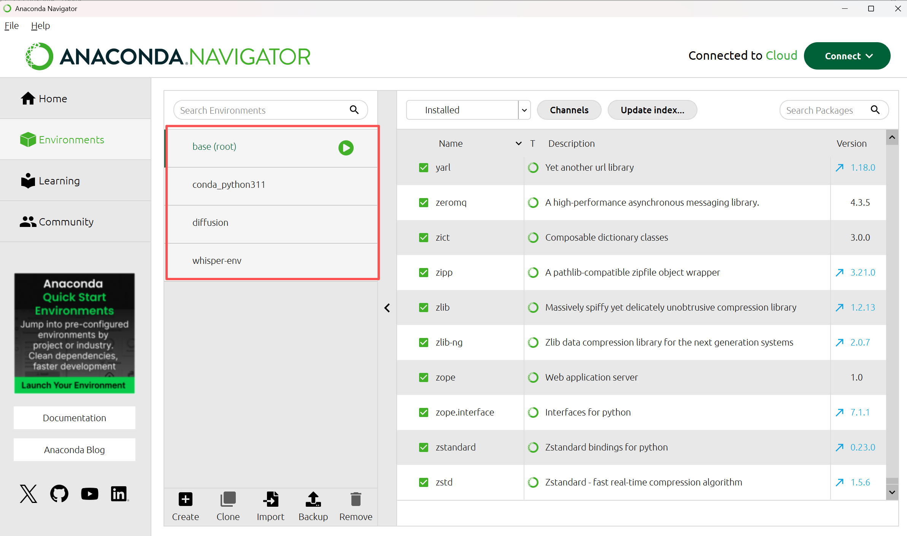

我现在有四个虚拟环境，jupyter模型使用的内核是base的，其他的默认都是没有内核的，需要自己进行配置

#### 我现在要为conda_python311安装ipython内核

首先，进入conda_python311虚拟环境

```bash
conda activate conda_python311
```

之后为这个环境安装`ipykernel`

```bash
conda install ipykernel
```

这样就安装好了内核

之后退出这个环境

```bash
conda deactivate
```


之后进入base环境，安装`nb_conda_kernels`

```bash
conda activate base
conda install nb_conda_kernels
```

这样只要虚拟环境里面安装了`ipykernel`，jupyter就可以检测到，就可以直接使用


配置完成之后我们就可以看到`conda_python311`就出现在了内核里面，其他的环境如果也需要配置，可以使用上属的方法安装`ipykernel`即可

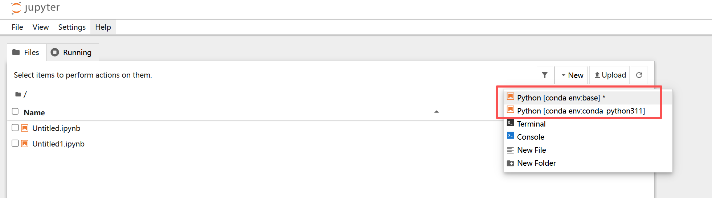


## 二、Qiskit环境

云服务平台参考文档：https://quantum.cloud.ibm.com/docs/en/tutorials

Qiskit本地部署：https://quantum.cloud.ibm.com/docs/en/guides/install-qiskit

### 2.1 本地部署流程

https://quantum.cloud.ibm.com/docs/en/guides/install-qiskit

#### 创建虚拟环境

```bash
conda create -n qiskit python=3.11
```

进入虚拟环境

```bash
conda activate qiskit
```

安装`qiskit`

```bash
pip install qiskit
```

安装`Qiskit Runtime`，可以帮助在量子硬件上运行作业

```bash
pip install qiskit-ibm-runtime
```

安装`qiskit[visualization]`，使得可以在使用可视化功能

```bash
pip install qiskit[visualization]
```

安装`jupyter`

```bash
pip install jupyter
```

进入jupyter

```bash
jupyter notebook
```

本地部署结束


### 2.2 线上使用Qiskit（ IBM QPU ）

https://quantum.cloud.ibm.com/docs/en/guides/cloud-setup

创建IBM Cloud账户

https://cloud.ibm.com/registration?utm_content=quantum-trial&target=https%3A%2F%2Fquantum.cloud.ibm.com&error_uri=

我使用google邮箱直接注册，之后登录页面如下

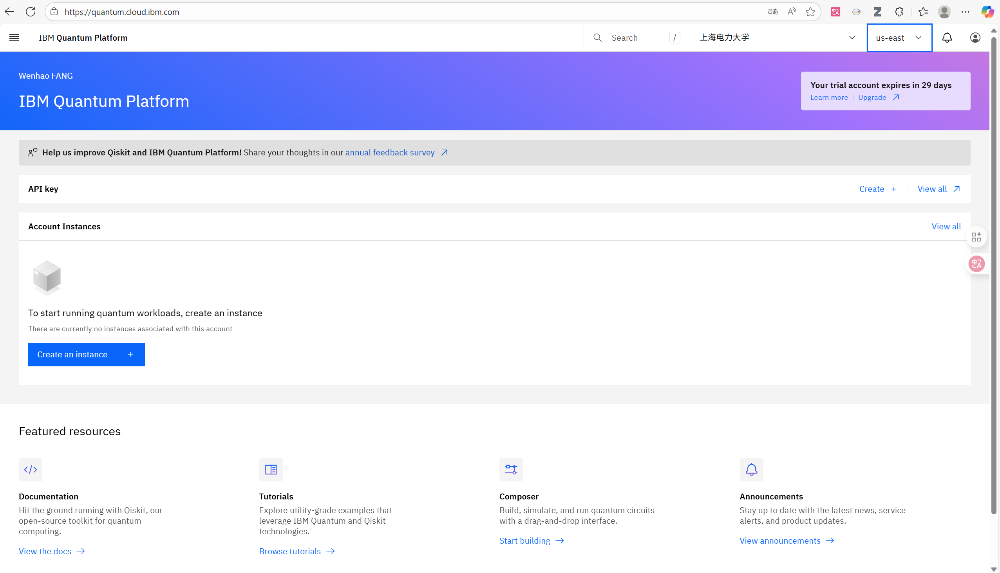

#### 创建实例（必须选择美国东部）

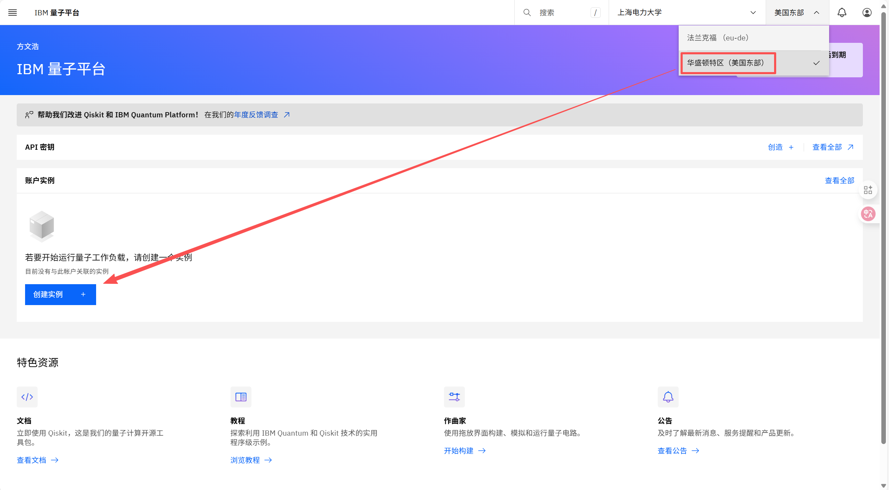

#### 创建实例的步骤

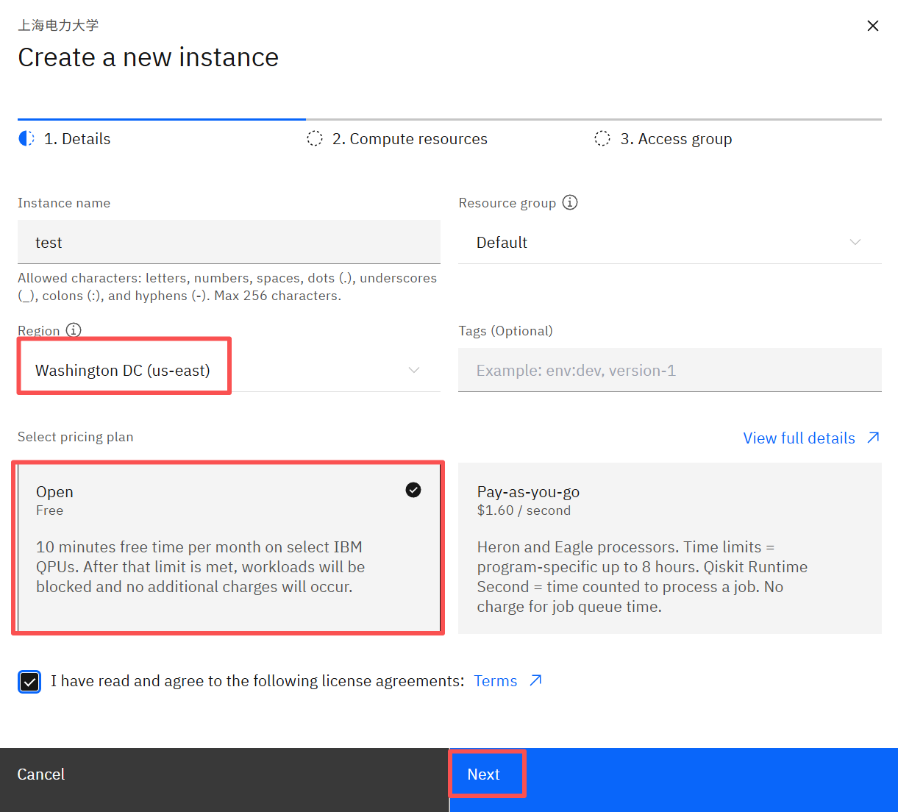

之后一步保持默认即可

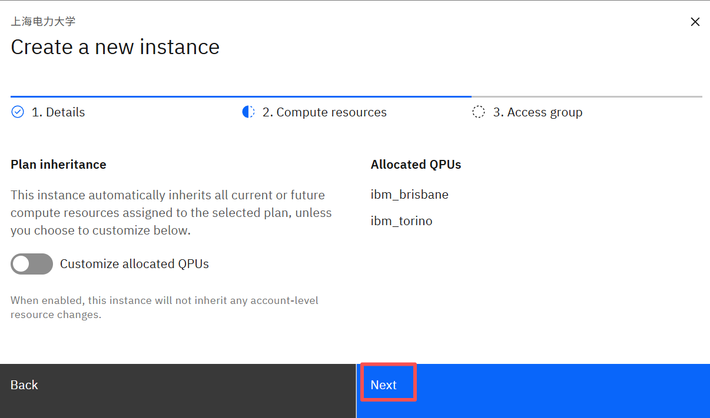

最后一步也可以保持默认，不进行设置

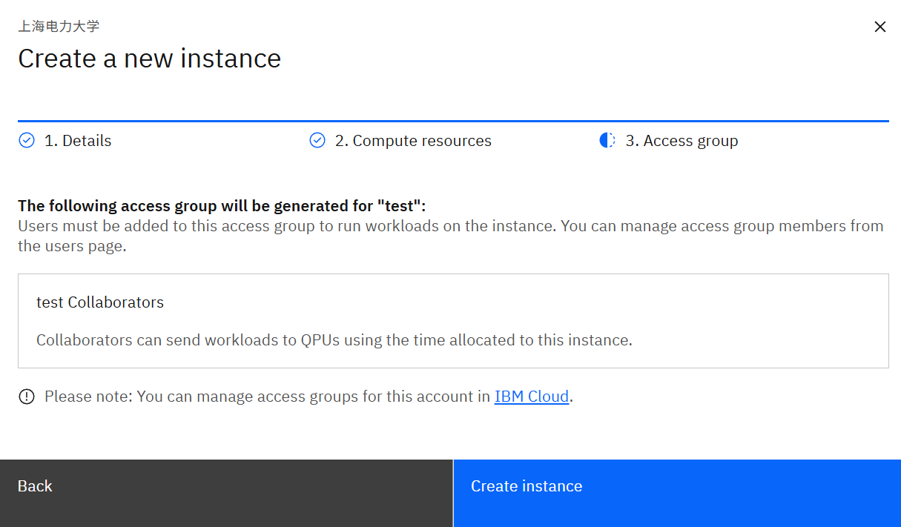

之后就可以进入工作区

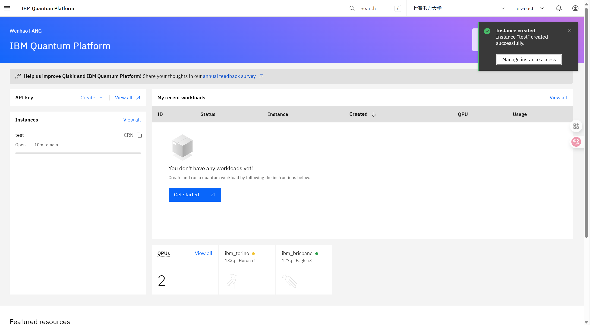

#### 创建一个API密钥

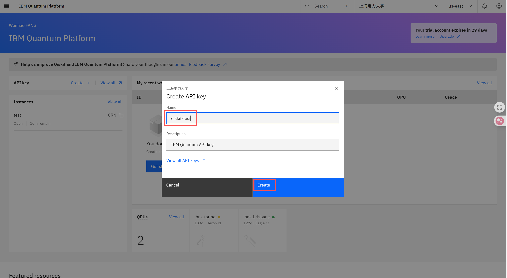

复制API密钥，之后可以使用这个进行连接

```
GWw5u8uzjYmwfw2H1tlhyGzcMJpteGr9mCE4eG_bG5q6
```

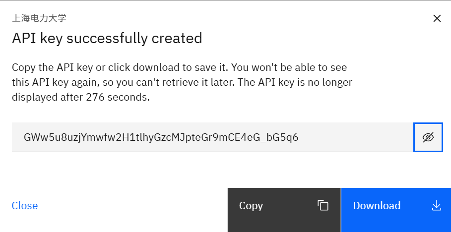

也可以复制实例的CRN，这个是实例的唯一标识

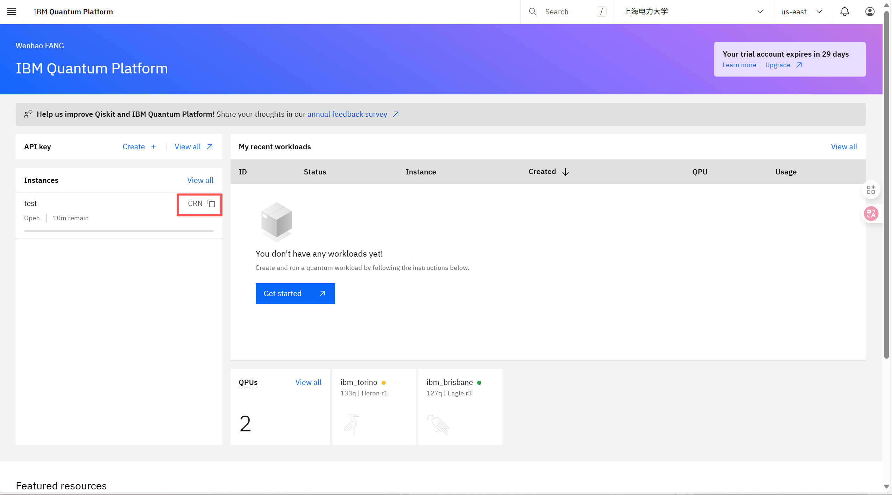

```
crn:v1:bluemix:public:quantum-computing:us-east:a/9346a60f9ff341149aa323b65b50dcbe:550a2dfc-24bd-4cfc-b097-a398c4f50e3b::
```


### 2.3 将Qiskit和服务实例连接

激活刚刚创建的虚拟环境

```bash
conda activate qiskit
```

使用代码将两者进行连接

```python
from qiskit_ibm_runtime import QiskitRuntimeService

# 保存 IBM Cloud 的 Qiskit Runtime 服务账户信息
service = QiskitRuntimeService.save_account(
    token="GWw5u8uzjYmwfw2H1tlhyGzcMJpteGr9mCE4eG_bG5q6",
    instance="crn:v1:bluemix:public:quantum-computing:us-east:a/9346a60f9ff341149aa323b65b50dcbe:550a2dfc-24bd-4cfc-b097-a398c4f50e3b::",
    plans_preference="['open', 'premium']",  # 如果是免费，选择open或者可以直接省略
    region="us-east",  # 默认使用us-east
    name="qiskit-test",  # 为账户设置一个名称，可以标识你前面的配置
    set_as_default=True  # 将该账户设置为默认账户（之后运行代码会直接使用这个账户）
)

print("IBM Qiskit Runtime account has been saved successfully!")
```

之后如果需要修改，可以再次运行一个`save_account`就可以重新定义一个账户，更新`token`和`CRN`

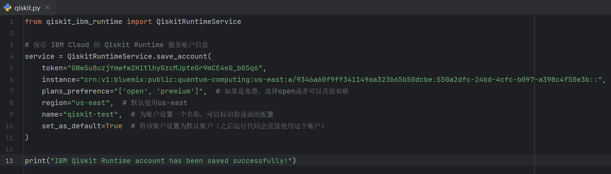

之后在虚拟环境下运行这段代码，文件名需要修改为`qiskit_test_script.py`

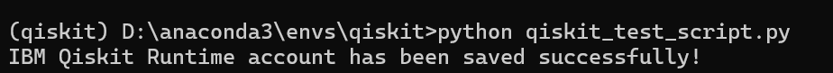

运行之后会生成一个文件，里面会包含这种配置信息，因此之后运行代码的时候就可以读取到

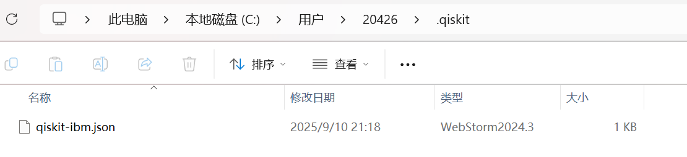

文件里面的信息如下

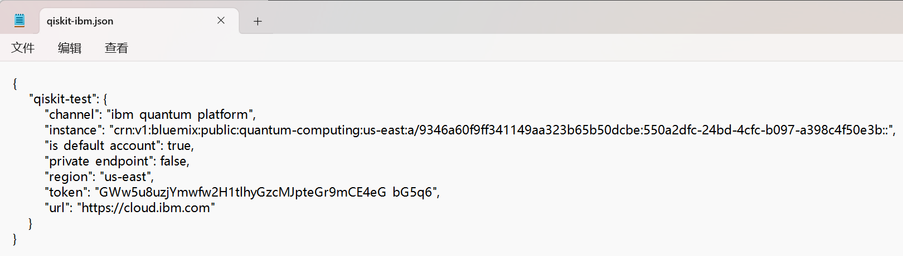


### 2.4 量子机器学习课程

https://quantum.cloud.ibm.com/learning/en/courses/basics-of-quantum-information/single-systems/introduction


## 三、pennylane环境

登录：https://pennylane.ai/account#account

用户名：xinyanyang2021@outlook.com
密码：Yxy1543371937!

pennylane简介：https://www.xanadu.ai/products/pennylane

https://pennylane.ai/install

https://docs.pennylane.ai/en/stable/introduction/circuits.html


csdn部署教程：https://blog.csdn.net/weixin_74850661/article/details/148519398